# Потоки данных

Успешное чтение `session:{id}` продлевает срок бездействия до 30 минут. В сеансе лежат `account_id` и признак CSRF. Роль и организация каждый раз читаются из `account`.

Ключ идемпотентности принадлежит одному запросу. Он читается до записи и сохраняется только после успешного сохранения. Повтор с тем же ключом возвращает прежний результат и не создаёт вторую строку, не применяет статус, пороги или правку ещё раз.

## D-01. Регистрация организации

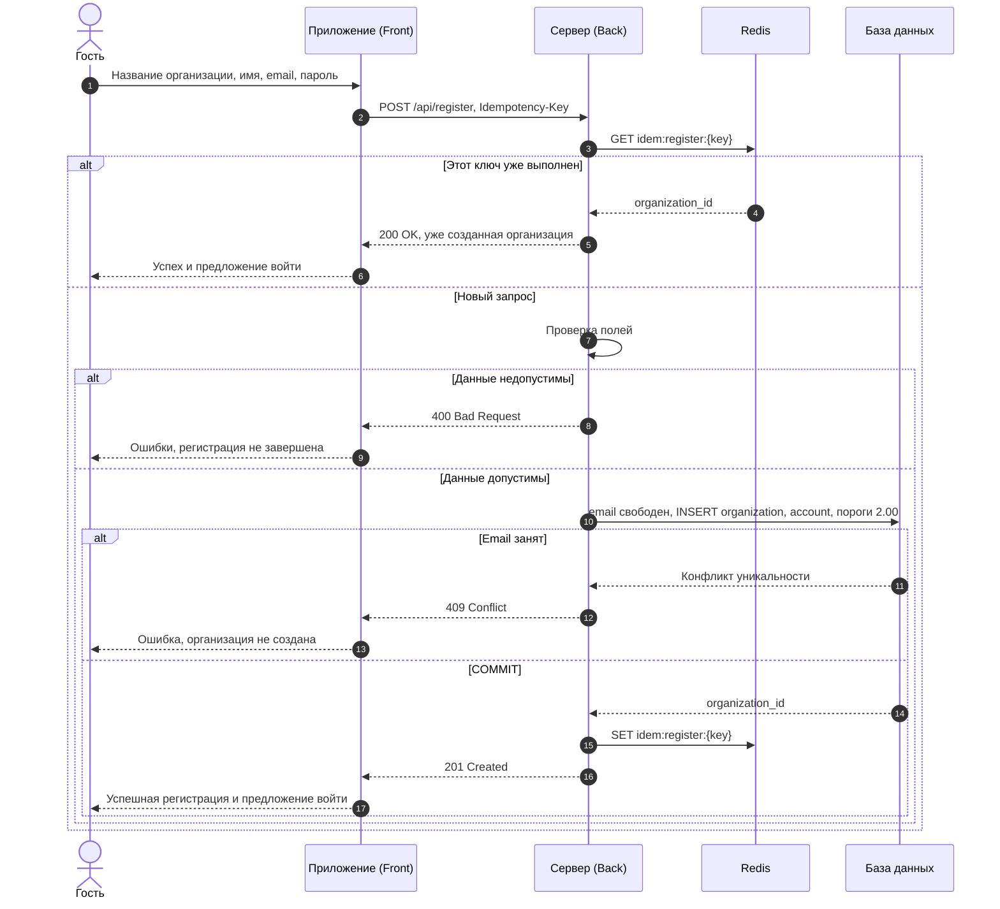
```mermaid
sequenceDiagram
    autonumber
    actor Guest as Гость
    participant Front as Приложение (Front)
    participant Back as Сервер (Back)
    participant Redis as Redis
    participant Db as База данных

    Guest->>Front: Название организации, имя, email, пароль
    Front->>Back: POST /api/register, Idempotency-Key
    Back->>Redis: GET idem:register:{key}
    alt Этот ключ уже выполнен
        Redis-->>Back: organization_id
        Back-->>Front: 200 OK, уже созданная организация
        Front-->>Guest: Успех и предложение войти
    else Новый запрос
        Back->>Back: Проверка полей
        alt Данные недопустимы
            Back-->>Front: 400 Bad Request
            Front-->>Guest: Ошибки, регистрация не завершена
        else Данные допустимы
            Back->>Db: email свободен, INSERT organization, account, пороги 2.00
            alt Email занят
                Db-->>Back: Конфликт уникальности
                Back-->>Front: 409 Conflict
                Front-->>Guest: Ошибка, организация не создана
            else COMMIT
                Db-->>Back: organization_id
                Back->>Redis: SET idem:register:{key}
                Back-->>Front: 201 Created
                Front-->>Guest: Успешная регистрация и предложение войти
            end
        end
    end
```

## D-02. Вход и выход

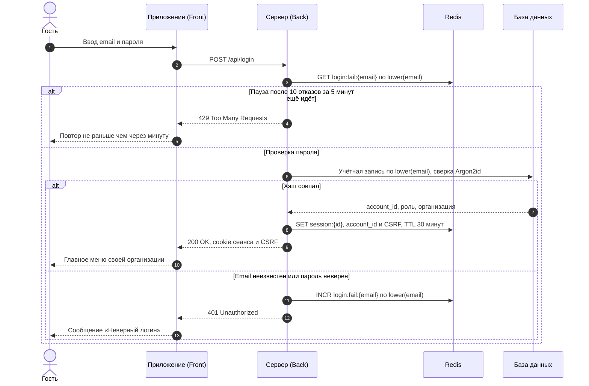
```mermaid
sequenceDiagram
    autonumber
    actor Guest as Гость
    participant Front as Приложение (Front)
    participant Back as Сервер (Back)
    participant Redis as Redis
    participant Db as База данных

    Guest->>Front: Ввод email и пароля
    Front->>Back: POST /api/login
    Back->>Redis: GET login:fail:{email} по lower(email)
    alt Пауза после 10 отказов за 5 минут ещё идёт
        Back-->>Front: 429 Too Many Requests
        Front-->>Guest: Повтор не раньше чем через минуту
    else Проверка пароля
        Back->>Db: Учётная запись по lower(email), сверка Argon2id
        alt Хэш совпал
            Db-->>Back: account_id, роль, организация
            Back->>Redis: SET session:{id}, account_id и CSRF, TTL 30 минут
            Back-->>Front: 200 OK, cookie сеанса и CSRF
            Front-->>Guest: Главное меню своей организации
        else Email неизвестен или пароль неверен
            Back->>Redis: INCR login:fail:{email} по lower(email)
            Back-->>Front: 401 Unauthorized
            Front-->>Guest: Сообщение «Неверный логин»
        end
    end
```

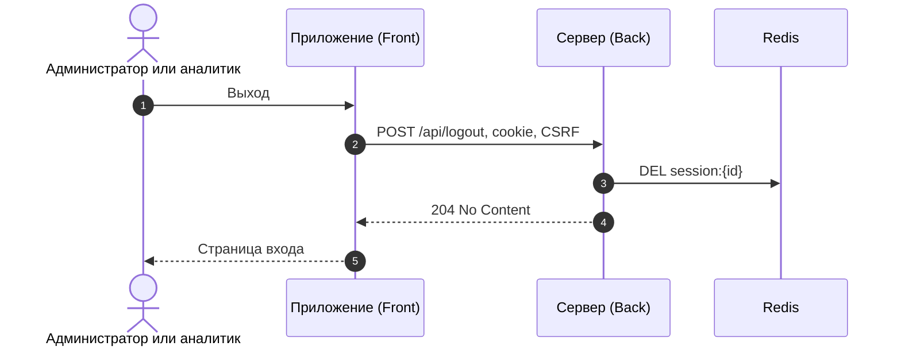
```mermaid
sequenceDiagram
    autonumber
    actor User as Администратор или аналитик
    participant Front as Приложение (Front)
    participant Back as Сервер (Back)
    participant Redis as Redis

    User->>Front: Выход
    Front->>Back: POST /api/logout, cookie, CSRF
    Back->>Redis: DEL session:{id}
    Back-->>Front: 204 No Content
    Front-->>User: Страница входа
```

## D-03. Присоединение по коду

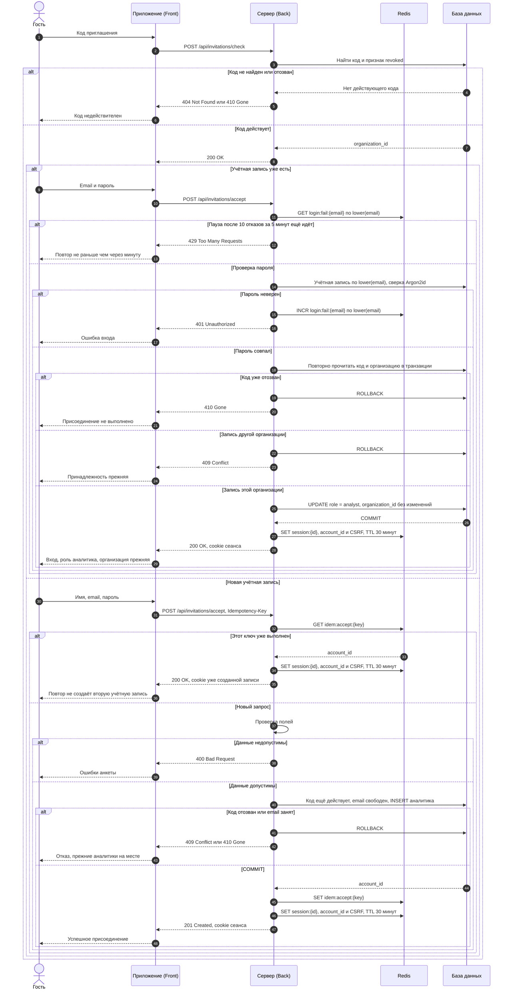
```mermaid
sequenceDiagram
    autonumber
    actor Guest as Гость
    participant Front as Приложение (Front)
    participant Back as Сервер (Back)
    participant Redis as Redis
    participant Db as База данных

    Guest->>Front: Код приглашения
    Front->>Back: POST /api/invitations/check
    Back->>Db: Найти код и признак revoked
    alt Код не найден или отозван
        Db-->>Back: Нет действующего кода
        Back-->>Front: 404 Not Found или 410 Gone
        Front-->>Guest: Код недействителен
    else Код действует
        Db-->>Back: organization_id
        Back-->>Front: 200 OK
        alt Учётная запись уже есть
            Guest->>Front: Email и пароль
            Front->>Back: POST /api/invitations/accept
            Back->>Redis: GET login:fail:{email} по lower(email)
            alt Пауза после 10 отказов за 5 минут ещё идёт
                Back-->>Front: 429 Too Many Requests
                Front-->>Guest: Повтор не раньше чем через минуту
            else Проверка пароля
                Back->>Db: Учётная запись по lower(email), сверка Argon2id
                alt Пароль неверен
                    Back->>Redis: INCR login:fail:{email} по lower(email)
                    Back-->>Front: 401 Unauthorized
                    Front-->>Guest: Ошибка входа
                else Пароль совпал
                    Back->>Db: Повторно прочитать код и организацию в транзакции
                    alt Код уже отозван
                        Back->>Db: ROLLBACK
                        Back-->>Front: 410 Gone
                        Front-->>Guest: Присоединение не выполнено
                    else Запись другой организации
                        Back->>Db: ROLLBACK
                        Back-->>Front: 409 Conflict
                        Front-->>Guest: Принадлежность прежняя
                    else Запись этой организации
                        Back->>Db: UPDATE role = analyst, organization_id без изменений
                        Db-->>Back: COMMIT
                        Back->>Redis: SET session:{id}, account_id и CSRF, TTL 30 минут
                        Back-->>Front: 200 OK, cookie сеанса
                        Front-->>Guest: Вход, роль аналитика, организация прежняя
                    end
                end
            end
        else Новая учётная запись
            Guest->>Front: Имя, email, пароль
            Front->>Back: POST /api/invitations/accept, Idempotency-Key
            Back->>Redis: GET idem:accept:{key}
            alt Этот ключ уже выполнен
                Redis-->>Back: account_id
                Back->>Redis: SET session:{id}, account_id и CSRF, TTL 30 минут
                Back-->>Front: 200 OK, cookie уже созданной записи
                Front-->>Guest: Повтор не создаёт вторую учётную запись
            else Новый запрос
                Back->>Back: Проверка полей
                alt Данные недопустимы
                    Back-->>Front: 400 Bad Request
                    Front-->>Guest: Ошибки анкеты
                else Данные допустимы
                    Back->>Db: Код ещё действует, email свободен, INSERT аналитика
                    alt Код отозван или email занят
                        Back->>Db: ROLLBACK
                        Back-->>Front: 409 Conflict или 410 Gone
                        Front-->>Guest: Отказ, прежние аналитики на месте
                    else COMMIT
                        Db-->>Back: account_id
                        Back->>Redis: SET idem:accept:{key}
                        Back->>Redis: SET session:{id}, account_id и CSRF, TTL 30 минут
                        Back-->>Front: 201 Created, cookie сеанса
                        Front-->>Guest: Успешное присоединение
                    end
                end
            end
        end
    end
```

## D-04. Просмотр профиля

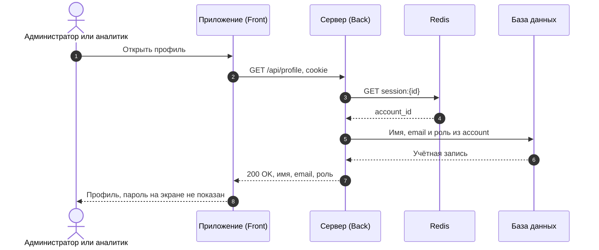
```mermaid
sequenceDiagram
    autonumber
    actor User as Администратор или аналитик
    participant Front as Приложение (Front)
    participant Back as Сервер (Back)
    participant Redis as Redis
    participant Db as База данных

    User->>Front: Открыть профиль
    Front->>Back: GET /api/profile, cookie
    Back->>Redis: GET session:{id}
    Redis-->>Back: account_id
    Back->>Db: Имя, email и роль из account
    Db-->>Back: Учётная запись
    Back-->>Front: 200 OK, имя, email, роль
    Front-->>User: Профиль, пароль на экране не показан
```

## D-05. Изменение профиля

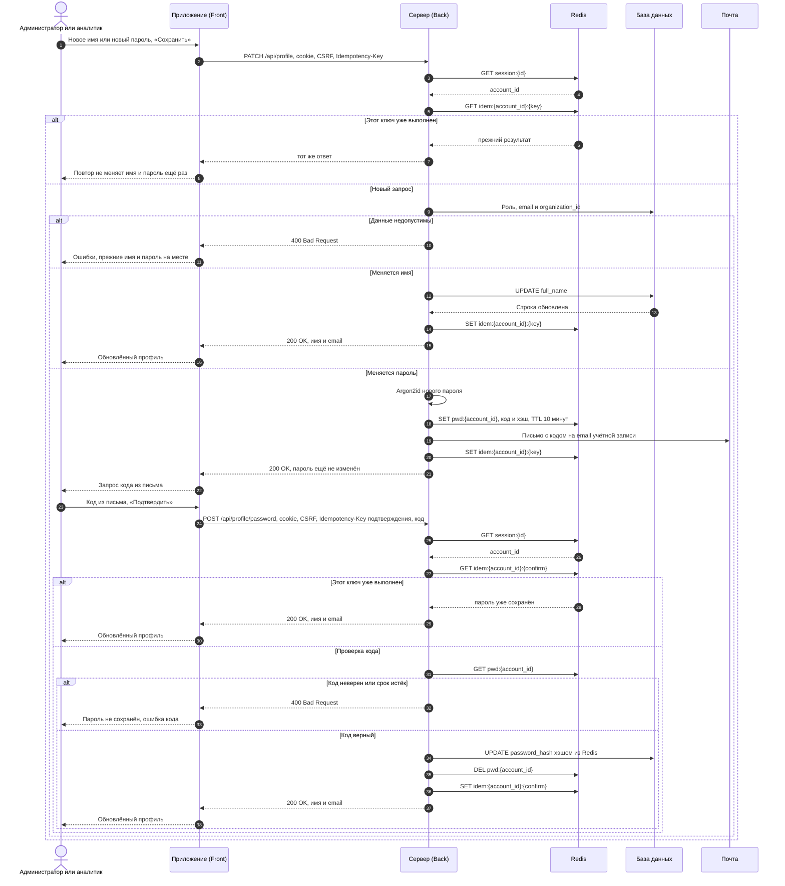
```mermaid
sequenceDiagram
    autonumber
    actor User as Администратор или аналитик
    participant Front as Приложение (Front)
    participant Back as Сервер (Back)
    participant Redis as Redis
    participant Db as База данных
    participant Mail as Почта

    User->>Front: Новое имя или новый пароль, «Сохранить»
    Front->>Back: PATCH /api/profile, cookie, CSRF, Idempotency-Key
    Back->>Redis: GET session:{id}
    Redis-->>Back: account_id
    Back->>Redis: GET idem:{account_id}:{key}
    alt Этот ключ уже выполнен
        Redis-->>Back: прежний результат
        Back-->>Front: тот же ответ
        Front-->>User: Повтор не меняет имя и пароль ещё раз
    else Новый запрос
        Back->>Db: Роль, email и organization_id
        alt Данные недопустимы
            Back-->>Front: 400 Bad Request
            Front-->>User: Ошибки, прежние имя и пароль на месте
        else Меняется имя
            Back->>Db: UPDATE full_name
            Db-->>Back: Строка обновлена
            Back->>Redis: SET idem:{account_id}:{key}
            Back-->>Front: 200 OK, имя и email
            Front-->>User: Обновлённый профиль
        else Меняется пароль
            Back->>Back: Argon2id нового пароля
            Back->>Redis: SET pwd:{account_id}, код и хэш, TTL 10 минут
            Back->>Mail: Письмо с кодом на email учётной записи
            Back->>Redis: SET idem:{account_id}:{key}
            Back-->>Front: 200 OK, пароль ещё не изменён
            Front-->>User: Запрос кода из письма
            User->>Front: Код из письма, «Подтвердить»
            Front->>Back: POST /api/profile/password, cookie, CSRF, Idempotency-Key подтверждения, код
            Back->>Redis: GET session:{id}
            Redis-->>Back: account_id
            Back->>Redis: GET idem:{account_id}:{confirm}
            alt Этот ключ уже выполнен
                Redis-->>Back: пароль уже сохранён
                Back-->>Front: 200 OK, имя и email
                Front-->>User: Обновлённый профиль
            else Проверка кода
                Back->>Redis: GET pwd:{account_id}
                alt Код неверен или срок истёк
                    Back-->>Front: 400 Bad Request
                    Front-->>User: Пароль не сохранён, ошибка кода
                else Код верный
                    Back->>Db: UPDATE password_hash хэшем из Redis
                    Back->>Redis: DEL pwd:{account_id}
                    Back->>Redis: SET idem:{account_id}:{confirm}
                    Back-->>Front: 200 OK, имя и email
                    Front-->>User: Обновлённый профиль
                end
            end
        end
    end
```

## D-06. Дашборд

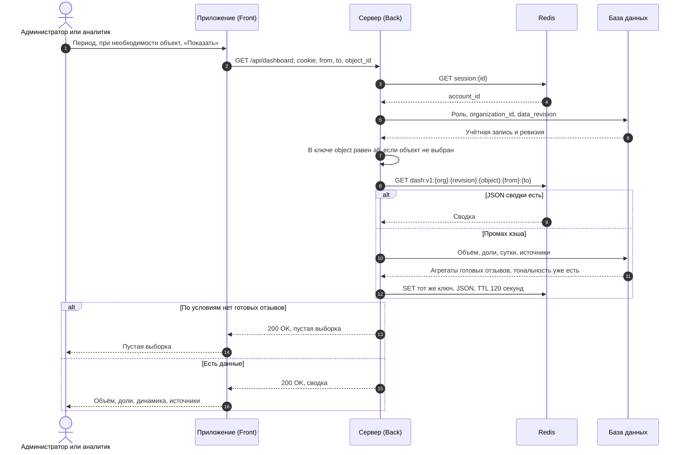
```mermaid
sequenceDiagram
    autonumber
    actor User as Администратор или аналитик
    participant Front as Приложение (Front)
    participant Back as Сервер (Back)
    participant Redis as Redis
    participant Db as База данных

    User->>Front: Период, при необходимости объект, «Показать»
    Front->>Back: GET /api/dashboard, cookie, from, to, object_id
    Back->>Redis: GET session:{id}
    Redis-->>Back: account_id
    Back->>Db: Роль, organization_id, data_revision
    Db-->>Back: Учётная запись и ревизия
    Back->>Back: В ключе object равен all, если объект не выбран
    Back->>Redis: GET dash:v1:{org}:{revision}:{object}:{from}:{to}
    alt JSON сводки есть
        Redis-->>Back: Сводка
    else Промах кэша
        Back->>Db: Объём, доли, сутки, источники
        Db-->>Back: Агрегаты готовых отзывов, тональность уже есть
        Back->>Redis: SET тот же ключ, JSON, TTL 120 секунд
    end
    alt По условиям нет готовых отзывов
        Back-->>Front: 200 OK, пустая выборка
        Front-->>User: Пустая выборка
    else Есть данные
        Back-->>Front: 200 OK, сводка
        Front-->>User: Объём, доли, динамика, источники
    end
```

## D-07. Лента отзывов

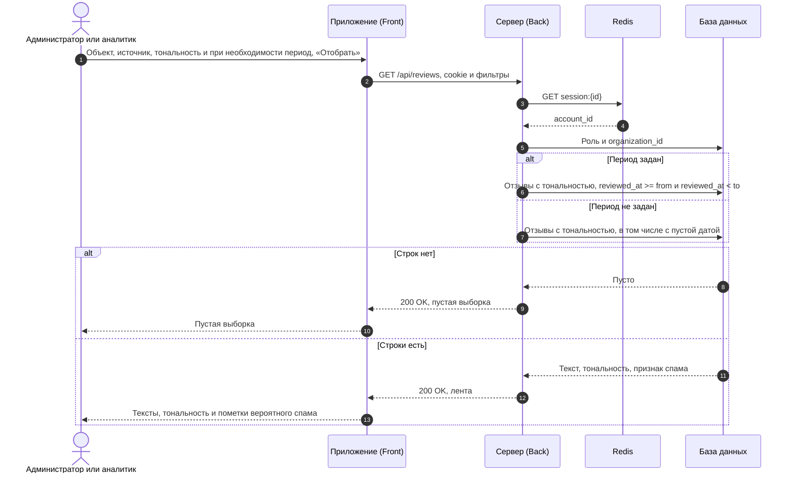
```mermaid
sequenceDiagram
    autonumber
    actor User as Администратор или аналитик
    participant Front as Приложение (Front)
    participant Back as Сервер (Back)
    participant Redis as Redis
    participant Db as База данных

    User->>Front: Объект, источник, тональность и при необходимости период, «Отобрать»
    Front->>Back: GET /api/reviews, cookie и фильтры
    Back->>Redis: GET session:{id}
    Redis-->>Back: account_id
    Back->>Db: Роль и organization_id
    alt Период задан
        Back->>Db: Отзывы с тональностью, reviewed_at >= from и reviewed_at < to
    else Период не задан
        Back->>Db: Отзывы с тональностью, в том числе с пустой датой
    end
    alt Строк нет
        Db-->>Back: Пусто
        Back-->>Front: 200 OK, пустая выборка
        Front-->>User: Пустая выборка
    else Строки есть
        Db-->>Back: Текст, тональность, признак спама
        Back-->>Front: 200 OK, лента
        Front-->>User: Тексты, тональность и пометки вероятного спама
    end
```

## D-08. Внутренние оповещения

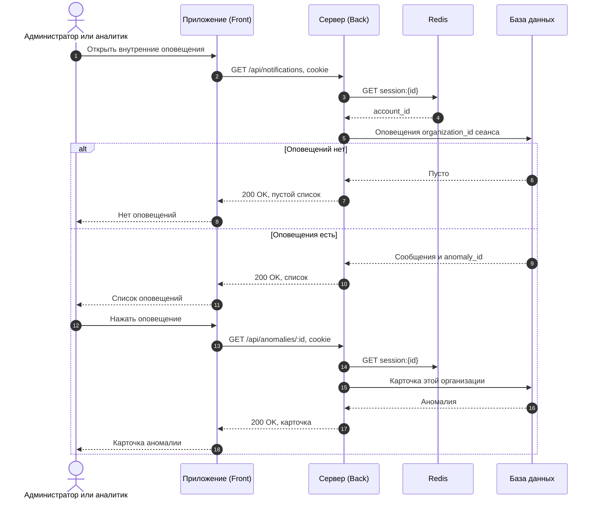
```mermaid
sequenceDiagram
    autonumber
    actor User as Администратор или аналитик
    participant Front as Приложение (Front)
    participant Back as Сервер (Back)
    participant Redis as Redis
    participant Db as База данных

    User->>Front: Открыть внутренние оповещения
    Front->>Back: GET /api/notifications, cookie
    Back->>Redis: GET session:{id}
    Redis-->>Back: account_id
    Back->>Db: Оповещения organization_id сеанса
    alt Оповещений нет
        Db-->>Back: Пусто
        Back-->>Front: 200 OK, пустой список
        Front-->>User: Нет оповещений
    else Оповещения есть
        Db-->>Back: Сообщения и anomaly_id
        Back-->>Front: 200 OK, список
        Front-->>User: Список оповещений
        User->>Front: Нажать оповещение
        Front->>Back: GET /api/anomalies/:id, cookie
        Back->>Redis: GET session:{id}
        Back->>Db: Карточка этой организации
        Db-->>Back: Аномалия
        Back-->>Front: 200 OK, карточка
        Front-->>User: Карточка аномалии
    end
```

## D-09. Список аномалий

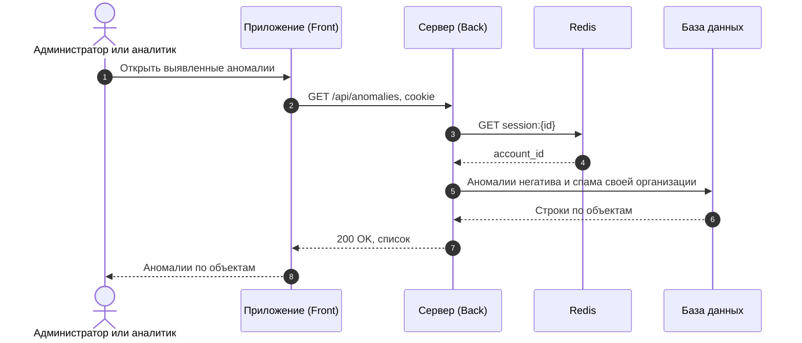
```mermaid
sequenceDiagram
    autonumber
    actor User as Администратор или аналитик
    participant Front as Приложение (Front)
    participant Back as Сервер (Back)
    participant Redis as Redis
    participant Db as База данных

    User->>Front: Открыть выявленные аномалии
    Front->>Back: GET /api/anomalies, cookie
    Back->>Redis: GET session:{id}
    Redis-->>Back: account_id
    Back->>Db: Аномалии негатива и спама своей организации
    Db-->>Back: Строки по объектам
    Back-->>Front: 200 OK, список
    Front-->>User: Аномалии по объектам
```

## D-10. Карточка аномалии

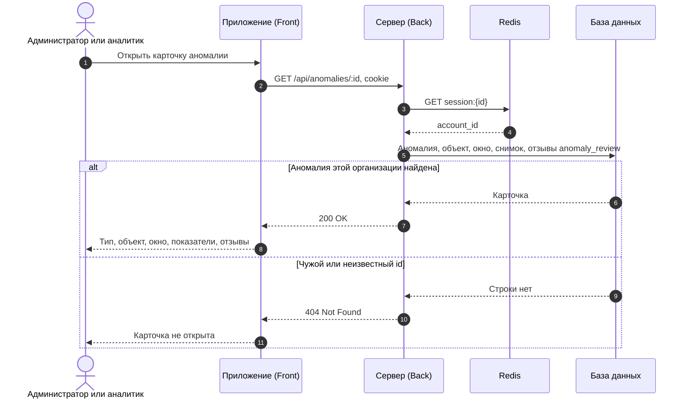
```mermaid
sequenceDiagram
    autonumber
    actor User as Администратор или аналитик
    participant Front as Приложение (Front)
    participant Back as Сервер (Back)
    participant Redis as Redis
    participant Db as База данных

    User->>Front: Открыть карточку аномалии
    Front->>Back: GET /api/anomalies/:id, cookie
    Back->>Redis: GET session:{id}
    Redis-->>Back: account_id
    Back->>Db: Аномалия, объект, окно, снимок, отзывы anomaly_review
    alt Аномалия этой организации найдена
        Db-->>Back: Карточка
        Back-->>Front: 200 OK
        Front-->>User: Тип, объект, окно, показатели, отзывы
    else Чужой или неизвестный id
        Db-->>Back: Строки нет
        Back-->>Front: 404 Not Found
        Front-->>User: Карточка не открыта
    end
```

## D-11. Разбор аномалии

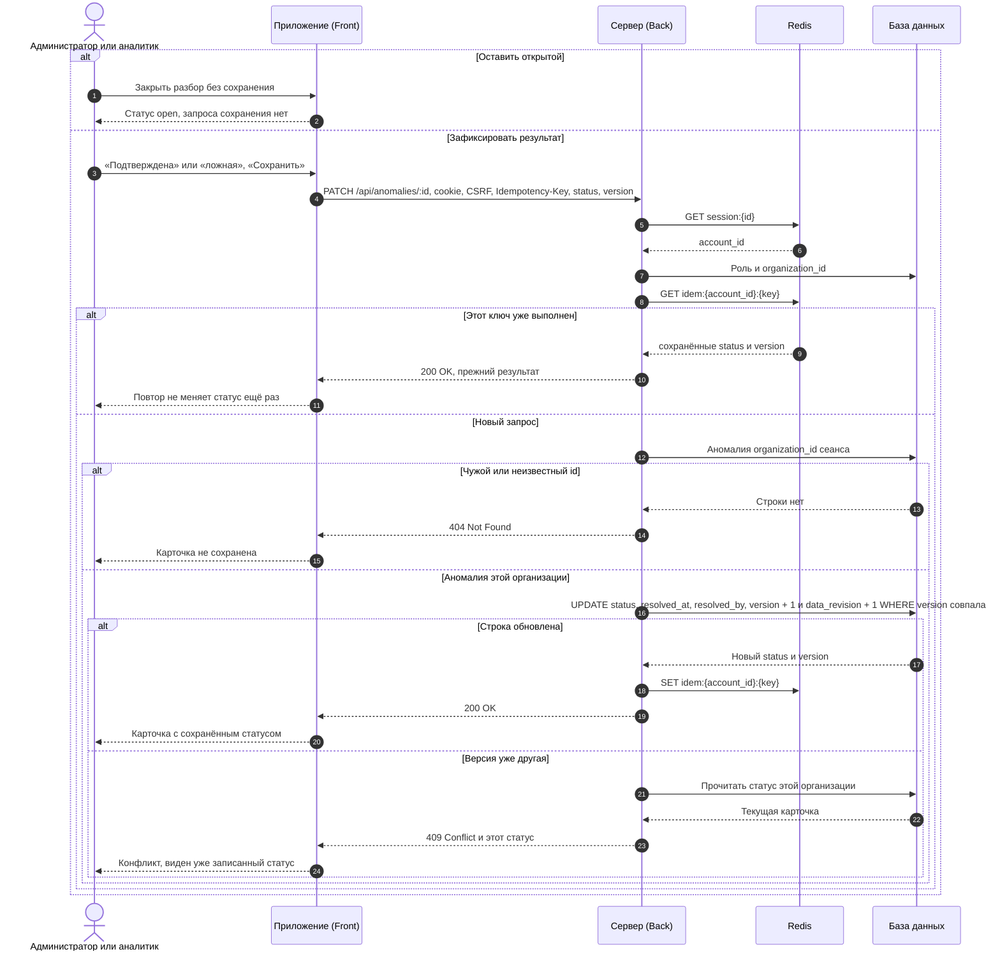
```mermaid
sequenceDiagram
    autonumber
    actor User as Администратор или аналитик
    participant Front as Приложение (Front)
    participant Back as Сервер (Back)
    participant Redis as Redis
    participant Db as База данных

    alt Оставить открытой
        User->>Front: Закрыть разбор без сохранения
        Front-->>User: Статус open, запроса сохранения нет
    else Зафиксировать результат
        User->>Front: «Подтверждена» или «ложная», «Сохранить»
        Front->>Back: PATCH /api/anomalies/:id, cookie, CSRF, Idempotency-Key, status, version
        Back->>Redis: GET session:{id}
        Redis-->>Back: account_id
        Back->>Db: Роль и organization_id
        Back->>Redis: GET idem:{account_id}:{key}
        alt Этот ключ уже выполнен
            Redis-->>Back: сохранённые status и version
            Back-->>Front: 200 OK, прежний результат
            Front-->>User: Повтор не меняет статус ещё раз
        else Новый запрос
            Back->>Db: Аномалия organization_id сеанса
            alt Чужой или неизвестный id
                Db-->>Back: Строки нет
                Back-->>Front: 404 Not Found
                Front-->>User: Карточка не сохранена
            else Аномалия этой организации
                Back->>Db: UPDATE status, resolved_at, resolved_by, version + 1 и data_revision + 1 WHERE version совпала
                alt Строка обновлена
                    Db-->>Back: Новый status и version
                    Back->>Redis: SET idem:{account_id}:{key}
                    Back-->>Front: 200 OK
                    Front-->>User: Карточка с сохранённым статусом
                else Версия уже другая
                    Back->>Db: Прочитать статус этой организации
                    Db-->>Back: Текущая карточка
                    Back-->>Front: 409 Conflict и этот статус
                    Front-->>User: Конфликт, виден уже записанный статус
                end
            end
        end
    end
```

## D-12. Создание кода приглашения

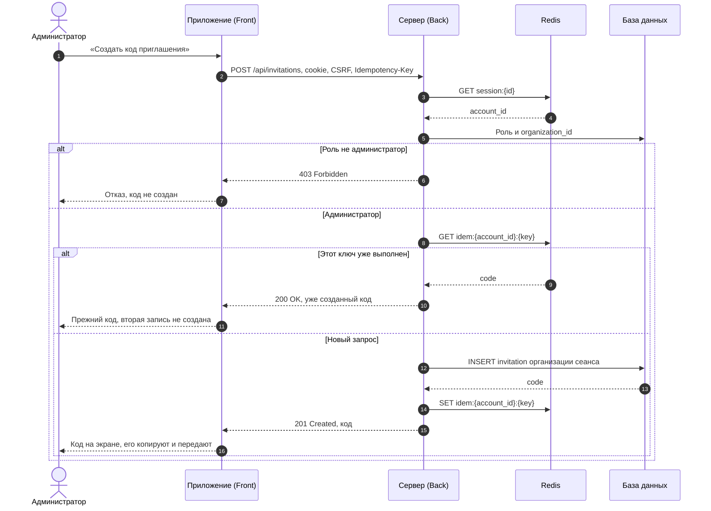
```mermaid
sequenceDiagram
    autonumber
    actor Admin as Администратор
    participant Front as Приложение (Front)
    participant Back as Сервер (Back)
    participant Redis as Redis
    participant Db as База данных

    Admin->>Front: «Создать код приглашения»
    Front->>Back: POST /api/invitations, cookie, CSRF, Idempotency-Key
    Back->>Redis: GET session:{id}
    Redis-->>Back: account_id
    Back->>Db: Роль и organization_id
    alt Роль не администратор
        Back-->>Front: 403 Forbidden
        Front-->>Admin: Отказ, код не создан
    else Администратор
        Back->>Redis: GET idem:{account_id}:{key}
        alt Этот ключ уже выполнен
            Redis-->>Back: code
            Back-->>Front: 200 OK, уже созданный код
            Front-->>Admin: Прежний код, вторая запись не создана
        else Новый запрос
            Back->>Db: INSERT invitation организации сеанса
            Db-->>Back: code
            Back->>Redis: SET idem:{account_id}:{key}
            Back-->>Front: 201 Created, код
            Front-->>Admin: Код на экране, его копируют и передают
        end
    end
```

## D-13. Отзыв кода приглашения

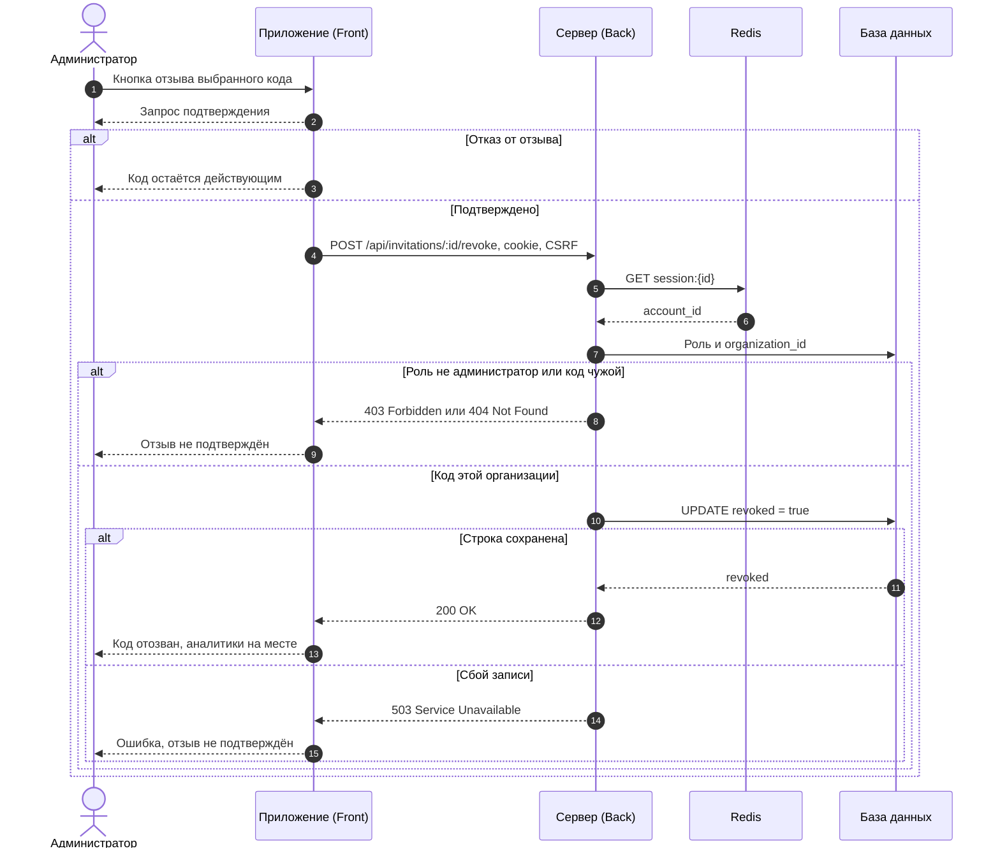
```mermaid
sequenceDiagram
    autonumber
    actor Admin as Администратор
    participant Front as Приложение (Front)
    participant Back as Сервер (Back)
    participant Redis as Redis
    participant Db as База данных

    Admin->>Front: Кнопка отзыва выбранного кода
    Front-->>Admin: Запрос подтверждения
    alt Отказ от отзыва
        Front-->>Admin: Код остаётся действующим
    else Подтверждено
        Front->>Back: POST /api/invitations/:id/revoke, cookie, CSRF
        Back->>Redis: GET session:{id}
        Redis-->>Back: account_id
        Back->>Db: Роль и organization_id
        alt Роль не администратор или код чужой
            Back-->>Front: 403 Forbidden или 404 Not Found
            Front-->>Admin: Отзыв не подтверждён
        else Код этой организации
            Back->>Db: UPDATE revoked = true
            alt Строка сохранена
                Db-->>Back: revoked
                Back-->>Front: 200 OK
                Front-->>Admin: Код отозван, аналитики на месте
            else Сбой записи
                Back-->>Front: 503 Service Unavailable
                Front-->>Admin: Ошибка, отзыв не подтверждён
            end
        end
    end
```

## D-14. Добавление товара или услуги

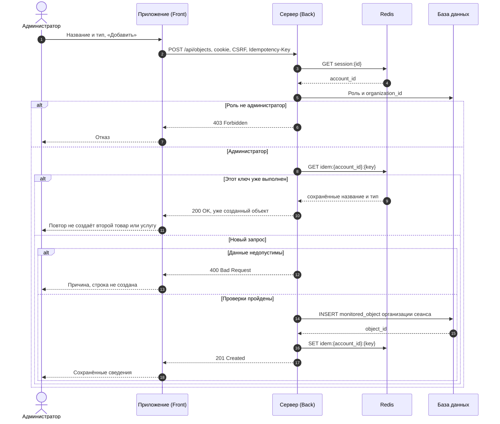
```mermaid
sequenceDiagram
    autonumber
    actor Admin as Администратор
    participant Front as Приложение (Front)
    participant Back as Сервер (Back)
    participant Redis as Redis
    participant Db as База данных

    Admin->>Front: Название и тип, «Добавить»
    Front->>Back: POST /api/objects, cookie, CSRF, Idempotency-Key
    Back->>Redis: GET session:{id}
    Redis-->>Back: account_id
    Back->>Db: Роль и organization_id
    alt Роль не администратор
        Back-->>Front: 403 Forbidden
        Front-->>Admin: Отказ
    else Администратор
        Back->>Redis: GET idem:{account_id}:{key}
        alt Этот ключ уже выполнен
            Redis-->>Back: сохранённые название и тип
            Back-->>Front: 200 OK, уже созданный объект
            Front-->>Admin: Повтор не создаёт второй товар или услугу
        else Новый запрос
            alt Данные недопустимы
                Back-->>Front: 400 Bad Request
                Front-->>Admin: Причина, строка не создана
            else Проверки пройдены
                Back->>Db: INSERT monitored_object организации сеанса
                Db-->>Back: object_id
                Back->>Redis: SET idem:{account_id}:{key}
                Back-->>Front: 201 Created
                Front-->>Admin: Сохранённые сведения
            end
        end
    end
```

## D-15. Изменение товара или услуги

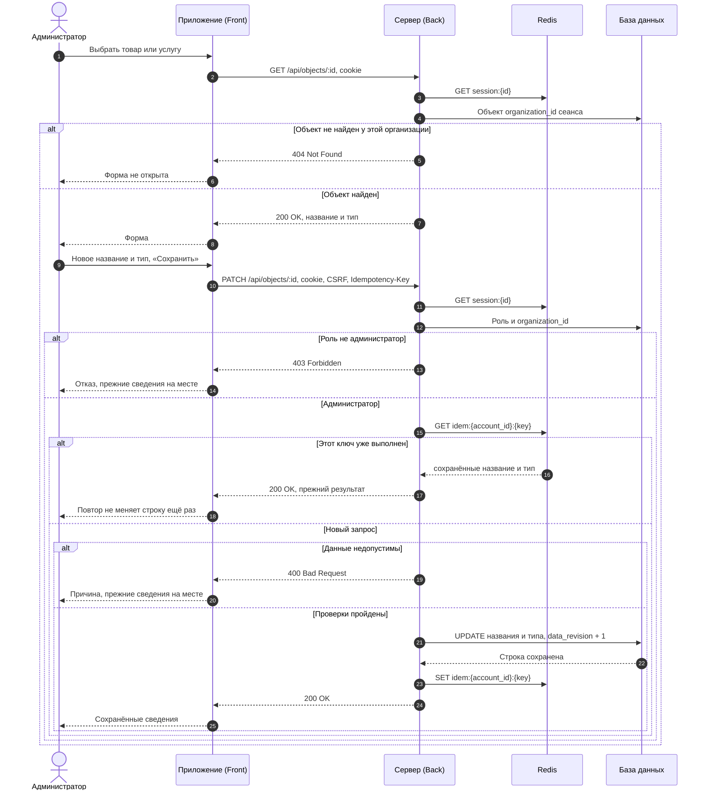
```mermaid
sequenceDiagram
    autonumber
    actor Admin as Администратор
    participant Front as Приложение (Front)
    participant Back as Сервер (Back)
    participant Redis as Redis
    participant Db as База данных

    Admin->>Front: Выбрать товар или услугу
    Front->>Back: GET /api/objects/:id, cookie
    Back->>Redis: GET session:{id}
    Back->>Db: Объект organization_id сеанса
    alt Объект не найден у этой организации
        Back-->>Front: 404 Not Found
        Front-->>Admin: Форма не открыта
    else Объект найден
        Back-->>Front: 200 OK, название и тип
        Front-->>Admin: Форма
        Admin->>Front: Новое название и тип, «Сохранить»
        Front->>Back: PATCH /api/objects/:id, cookie, CSRF, Idempotency-Key
        Back->>Redis: GET session:{id}
        Back->>Db: Роль и organization_id
        alt Роль не администратор
            Back-->>Front: 403 Forbidden
            Front-->>Admin: Отказ, прежние сведения на месте
        else Администратор
            Back->>Redis: GET idem:{account_id}:{key}
            alt Этот ключ уже выполнен
                Redis-->>Back: сохранённые название и тип
                Back-->>Front: 200 OK, прежний результат
                Front-->>Admin: Повтор не меняет строку ещё раз
            else Новый запрос
                alt Данные недопустимы
                    Back-->>Front: 400 Bad Request
                    Front-->>Admin: Причина, прежние сведения на месте
                else Проверки пройдены
                    Back->>Db: UPDATE названия и типа, data_revision + 1
                    Db-->>Back: Строка сохранена
                    Back->>Redis: SET idem:{account_id}:{key}
                    Back-->>Front: 200 OK
                    Front-->>Admin: Сохранённые сведения
                end
            end
        end
    end
```

## D-16. Подключение источника

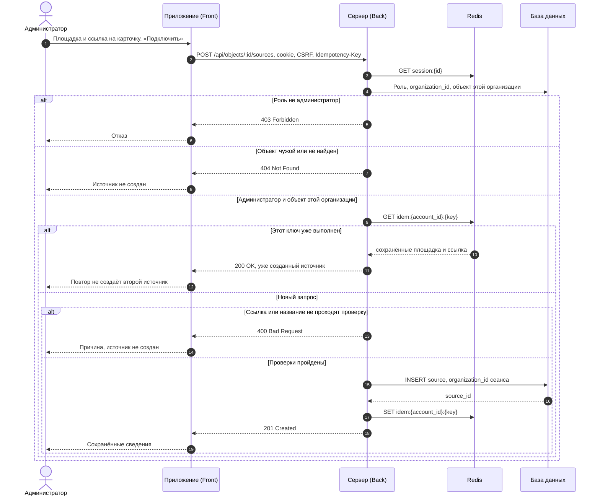
```mermaid
sequenceDiagram
    autonumber
    actor Admin as Администратор
    participant Front as Приложение (Front)
    participant Back as Сервер (Back)
    participant Redis as Redis
    participant Db as База данных

    Admin->>Front: Площадка и ссылка на карточку, «Подключить»
    Front->>Back: POST /api/objects/:id/sources, cookie, CSRF, Idempotency-Key
    Back->>Redis: GET session:{id}
    Back->>Db: Роль, organization_id, объект этой организации
    alt Роль не администратор
        Back-->>Front: 403 Forbidden
        Front-->>Admin: Отказ
    else Объект чужой или не найден
        Back-->>Front: 404 Not Found
        Front-->>Admin: Источник не создан
    else Администратор и объект этой организации
        Back->>Redis: GET idem:{account_id}:{key}
        alt Этот ключ уже выполнен
            Redis-->>Back: сохранённые площадка и ссылка
            Back-->>Front: 200 OK, уже созданный источник
            Front-->>Admin: Повтор не создаёт второй источник
        else Новый запрос
            alt Ссылка или название не проходят проверку
                Back-->>Front: 400 Bad Request
                Front-->>Admin: Причина, источник не создан
            else Проверки пройдены
                Back->>Db: INSERT source, organization_id сеанса
                Db-->>Back: source_id
                Back->>Redis: SET idem:{account_id}:{key}
                Back-->>Front: 201 Created
                Front-->>Admin: Сохранённые сведения
            end
        end
    end
```

## D-17. Изменение источника

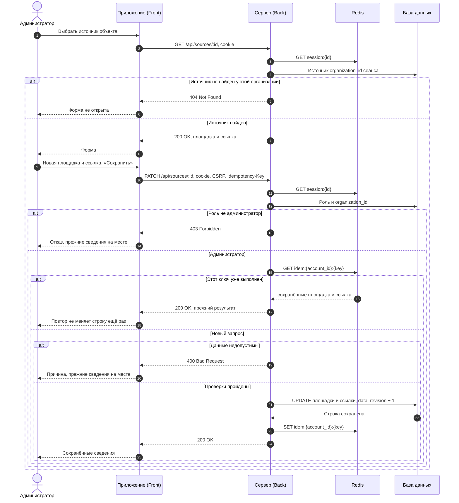
```mermaid
sequenceDiagram
    autonumber
    actor Admin as Администратор
    participant Front as Приложение (Front)
    participant Back as Сервер (Back)
    participant Redis as Redis
    participant Db as База данных

    Admin->>Front: Выбрать источник объекта
    Front->>Back: GET /api/sources/:id, cookie
    Back->>Redis: GET session:{id}
    Back->>Db: Источник organization_id сеанса
    alt Источник не найден у этой организации
        Back-->>Front: 404 Not Found
        Front-->>Admin: Форма не открыта
    else Источник найден
        Back-->>Front: 200 OK, площадка и ссылка
        Front-->>Admin: Форма
        Admin->>Front: Новая площадка и ссылка, «Сохранить»
        Front->>Back: PATCH /api/sources/:id, cookie, CSRF, Idempotency-Key
        Back->>Redis: GET session:{id}
        Back->>Db: Роль и organization_id
        alt Роль не администратор
            Back-->>Front: 403 Forbidden
            Front-->>Admin: Отказ, прежние сведения на месте
        else Администратор
            Back->>Redis: GET idem:{account_id}:{key}
            alt Этот ключ уже выполнен
                Redis-->>Back: сохранённые площадка и ссылка
                Back-->>Front: 200 OK, прежний результат
                Front-->>Admin: Повтор не меняет строку ещё раз
            else Новый запрос
                alt Данные недопустимы
                    Back-->>Front: 400 Bad Request
                    Front-->>Admin: Причина, прежние сведения на месте
                else Проверки пройдены
                    Back->>Db: UPDATE площадки и ссылки, data_revision + 1
                    Db-->>Back: Строка сохранена
                    Back->>Redis: SET idem:{account_id}:{key}
                    Back-->>Front: 200 OK
                    Front-->>Admin: Сохранённые сведения
                end
            end
        end
    end
```

## D-18. Импорт CSV

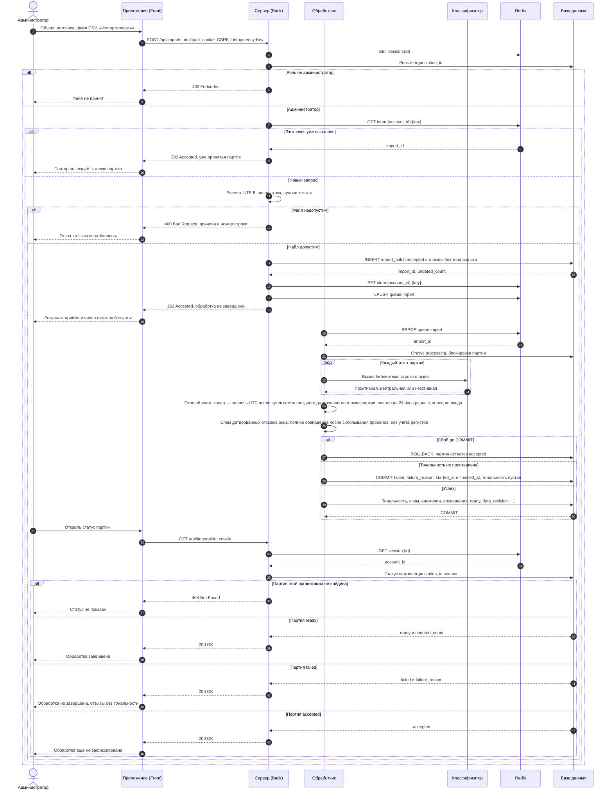
```mermaid
sequenceDiagram
    autonumber
    actor Admin as Администратор
    participant Front as Приложение (Front)
    participant Back as Сервер (Back)
    participant Worker as Обработчик
    participant Model as Классификатор
    participant Redis as Redis
    participant Db as База данных

    Admin->>Front: Объект, источник, файл CSV, «Импортировать»
    Front->>Back: POST /api/imports, multipart, cookie, CSRF, Idempotency-Key
    Back->>Redis: GET session:{id}
    Back->>Db: Роль и organization_id
    alt Роль не администратор
        Back-->>Front: 403 Forbidden
        Front-->>Admin: Файл не принят
    else Администратор
        Back->>Redis: GET idem:{account_id}:{key}
        alt Этот ключ уже выполнен
            Redis-->>Back: import_id
            Back-->>Front: 202 Accepted, уже принятая партия
            Front-->>Admin: Повтор не создаёт вторую партию
        else Новый запрос
            Back->>Back: Размер, UTF-8, число строк, пустые тексты
            alt Файл недопустим
                Back-->>Front: 400 Bad Request, причина и номер строки
                Front-->>Admin: Отказ, отзывы не добавлены
            else Файл допустим
                Back->>Db: INSERT import_batch accepted и отзывы без тональности
                Db-->>Back: import_id, undated_count
                Back->>Redis: SET idem:{account_id}:{key}
                Back->>Redis: LPUSH queue:import
                Back-->>Front: 202 Accepted, обработка не завершена
                Front-->>Admin: Результат приёма и число отзывов без даты
                Worker->>Redis: BRPOP queue:import
                Redis-->>Worker: import_id
                Worker->>Db: Статус processing, блокировка партии
                loop Каждый текст партии
                    Worker->>Model: Вызов библиотеки, строка отзыва
                    Model-->>Worker: позитивная, нейтральная или негативная
                end
                Worker->>Worker: Окно объекта: конец — полночь UTC после суток самого позднего датированного отзыва партии, начало на 24 часа раньше, конец не входит
                Worker->>Worker: Спам датированных отзывов окна: полное совпадение после схлопывания пробелов, без учёта регистра
                alt Сбой до COMMIT
                    Worker->>Db: ROLLBACK, партия остаётся accepted
                else Тональность не проставлена
                    Worker->>Db: COMMIT failed, failure_reason, started_at и finished_at, тональность пустая
                else Успех
                    Worker->>Db: Тональность, спам, аномалии, оповещения, ready, data_revision + 1
                    Db-->>Worker: COMMIT
                end
                Admin->>Front: Открыть статус партии
                Front->>Back: GET /api/imports/:id, cookie
                Back->>Redis: GET session:{id}
                Redis-->>Back: account_id
                Back->>Db: Статус партии organization_id сеанса
                alt Партия этой организации не найдена
                    Back-->>Front: 404 Not Found
                    Front-->>Admin: Статус не показан
                else Партия ready
                    Db-->>Back: ready и undated_count
                    Back-->>Front: 200 OK
                    Front-->>Admin: Обработка завершена
                else Партия failed
                    Db-->>Back: failed и failure_reason
                    Back-->>Front: 200 OK
                    Front-->>Admin: Обработка не завершена, отзывы без тональности
                else Партия accepted
                    Db-->>Back: accepted
                    Back-->>Front: 200 OK
                    Front-->>Admin: Обработка ещё не зафиксирована
                end
            end
        end
    end
```

## D-19. Пороги

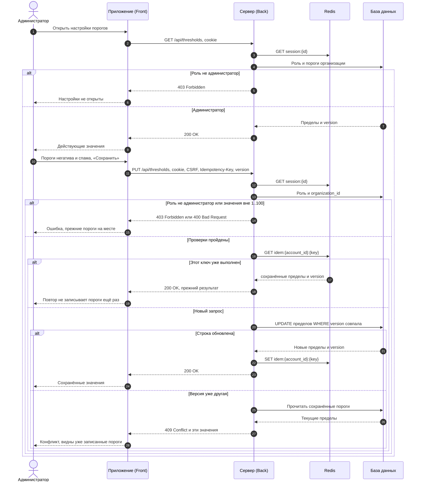
```mermaid
sequenceDiagram
    autonumber
    actor Admin as Администратор
    participant Front as Приложение (Front)
    participant Back as Сервер (Back)
    participant Redis as Redis
    participant Db as База данных

    Admin->>Front: Открыть настройки порогов
    Front->>Back: GET /api/thresholds, cookie
    Back->>Redis: GET session:{id}
    Back->>Db: Роль и пороги организации
    alt Роль не администратор
        Back-->>Front: 403 Forbidden
        Front-->>Admin: Настройки не открыты
    else Администратор
        Db-->>Back: Пределы и version
        Back-->>Front: 200 OK
        Front-->>Admin: Действующие значения
        Admin->>Front: Пороги негатива и спама, «Сохранить»
        Front->>Back: PUT /api/thresholds, cookie, CSRF, Idempotency-Key, version
        Back->>Redis: GET session:{id}
        Back->>Db: Роль и organization_id
        alt Роль не администратор или значения вне 1..100
            Back-->>Front: 403 Forbidden или 400 Bad Request
            Front-->>Admin: Ошибка, прежние пороги на месте
        else Проверки пройдены
            Back->>Redis: GET idem:{account_id}:{key}
            alt Этот ключ уже выполнен
                Redis-->>Back: сохранённые пределы и version
                Back-->>Front: 200 OK, прежний результат
                Front-->>Admin: Повтор не записывает пороги ещё раз
            else Новый запрос
                Back->>Db: UPDATE пределов WHERE version совпала
                alt Строка обновлена
                    Db-->>Back: Новые пределы и version
                    Back->>Redis: SET idem:{account_id}:{key}
                    Back-->>Front: 200 OK
                    Front-->>Admin: Сохранённые значения
                else Версия уже другая
                    Back->>Db: Прочитать сохранённые пороги
                    Db-->>Back: Текущие пределы
                    Back-->>Front: 409 Conflict и эти значения
                    Front-->>Admin: Конфликт, видны уже записанные пороги
                end
            end
        end
    end
```
